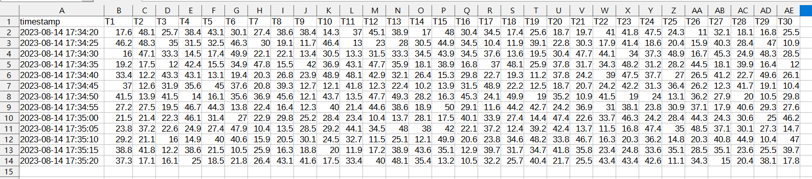

# TB_and_RPi
Thingsboard &amp; Raspberry Pi Training

## 專案介紹:
* [mqtt_simple.py](./Code/mqtt_simple.py) :python模擬溫濕度模組 發送資料(mqtt)
* [TB_export_CSV.js](./Code/TB_export_CSV.js):Thingsboard widgets 加入javascritp 創建數據匯出CSV功能
### 截圖:  
<kbd></kbd>
<kbd></kbd>
<kbd></kbd>

#### 其它:  
2023/08/13 17:18 

